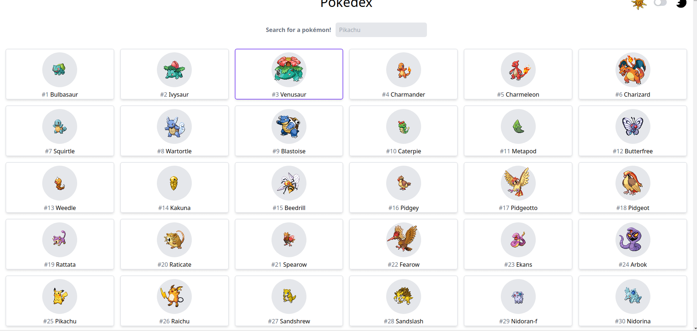

# Pokédex

Welcome to the repository of the web app `Pokédex`. The live site can be found at https://davidherszenhaut.github.io/pokedex/.

 

<p align="center">
  
</p>

## Table of Contents

- [About](#about)
- [Installation](#installation)
- [Contributing](#contributing)

## About

`Pokédex` is a web app where users can view information about Pokémon. It was built using [React](https://reactjs.org/), [Tailwind](https://tailwindcss.com/), and [Headless UI](https://headlessui.dev/). The data was retrieved from [PokéApi](https://pokeapi.co/).

## Installation

If you want to install and run `Pokédex` locally, follow these steps:

1. Install [Node.js](https://nodejs.org/).

2. Clone the repository

```bash
git clone https://github.com/davidherszenhaut/pokedex.git
```

3. Go into the repository

```bash
cd pokedex/
```

4. Install the dependencies

```bash
npm install
```

5. Start the project

```bash
npm start
```

`Pokédex` will now be running at `http://localhost:3000/pokedex`

## Contributing

### Issues

If you run into any problems with `Pokédex` (live or locally), please feel free to create a new [issue](https://github.com/davidherszenhaut/pokedex/issues) if you see that one does not already exist for your problem. Make sure to include as much information as possible in the body of the issue to make fixing the problem easier.

### Pull Requests

If you have written some code for a new feature or bug fix, please feel free to open a pull request, but make sure that an issue describing your new feature or bug fix exists first. Include a "closing" keyword somewhere in the body of your pull request so that it can be automatically linked to the related issue. For example, adding `Fixes #17` to the body of your pull request will link it to issue number 17 in the repository. Also, be sure to write [semantic commit messages](https://www.conventionalcommits.org/en/v1.0.0/). When a pull request is created, a workflow will trigger with some checks that need to pass before merging is allowed. If you wish to run these checks locally before creating your pull request, you can use these commands:

- Prettier

```bash
npx prettier --check . # `npx prettier --write .` will format your code if there are any issues.
```

- ESLint

```bash
npx eslint . --ext .js,.jsx,.jts,.tsx
```

- Jest

```bash
npm run test
```

### Documentation

Documentation for the code is autogenerated using [TypeDoc](https://typedoc.org/). Once you have cloned the repository and installed its dependencies, run `npm run docs` and documentation will appear in the `/docs` directory.
